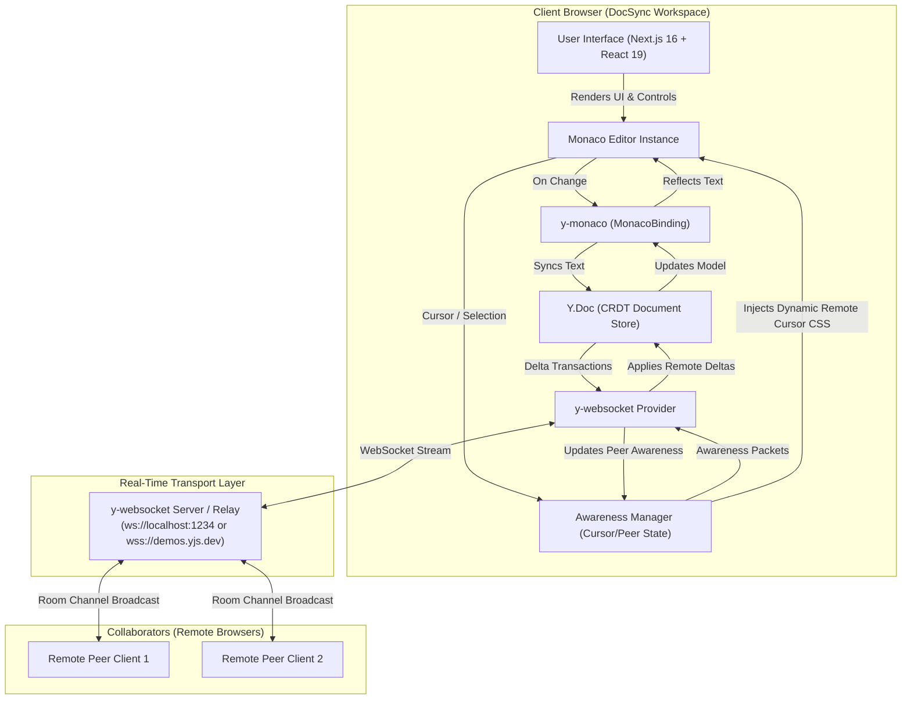
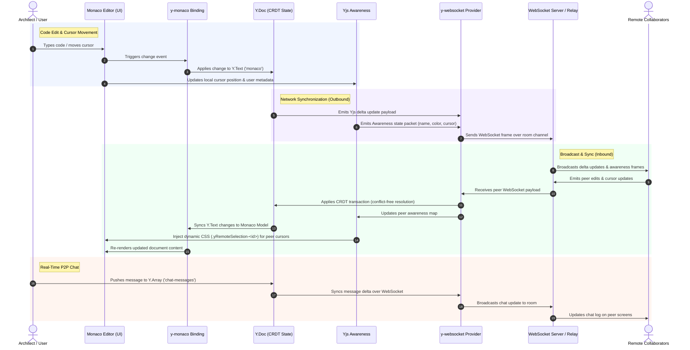

# DocSync PRO — Real-Time Collaborative Workspace

[](https://nextjs.org/)
[](https://react.dev/)
[](https://yjs.dev/)
[](https://microsoft.github.io/monaco-editor/)
[](https://tailwindcss.com/)

**DocSync PRO** is a state-of-the-art, high-performance real-time collaborative code editor built with **Next.js 16**, **React 19**, **Monaco Editor**, and **Yjs CRDTs**. It enables developers to create or join workspace rooms, collaborate on code in real time, observe dynamic collaborator cursors, and communicate through an integrated real-time chat.

---

## 🌟 Key Features

- ⚡ **Conflict-Free Real-Time Collaboration**: Powered by Yjs Conflict-Free Replicated Data Types (CRDTs), ensuring zero merge conflicts across concurrent edits.
- 💻 **Monaco Code Editor**: Professional editing experience with syntax highlighting, auto-formatting (`Ctrl+S` or toolbar button), customizable font sizes (12px–20px), and toggleable auto-suggestions.
- 🎯 **Live Remote Cursors & Selection**: Dynamic CSS injection injects collaborator cursor flags and text selections directly into Monaco in real time with custom assigned colors.
- 💬 **Integrated Real-Time Chat**: Synchronized P2P room chat built on Yjs shared arrays (`Y.Array`), featuring timestamps, color-coded sender badges, and clickable URL rendering.
- 👥 **Collaborator Presence & Roster**: Real-time awareness monitoring via `provider.awareness` tracking online peers and active room count.
- 🎨 **Modern Glassmorphism Design System**: Sleek mesh layout with dark/light mode switching, responsive mobile overlay drawers, and subtle micro-animations.
- 🔗 **Instant Room Sharing**: Unique 5-character Workspace IDs (e.g. `ALPHA`) with single-click invite link copying.

---

## 🏗️ Architecture & Real-Time Data Flow

### 1. System Data Flow Diagram



---

### 2. Synchronization Sequence Diagram



---

## 🛠️ Technology Stack

| Layer | Technology | Description |
| :--- | :--- | :--- |
| **Framework** | [Next.js 16.1.6](https://nextjs.org/) | App Router, Server/Client components, SSR optimization |
| **UI Library** | [React 19.2.3](https://react.dev/) | Dynamic hooks, state management, concurrent rendering |
| **Code Editor** | [`@monaco-editor/react`](https://github.com/suren-atoyan/monaco-react) | VS Code editing experience in browser |
| **CRDT Protocol** | [`yjs`](https://yjs.dev/) | High-performance CRDT framework for real-time state |
| **Network Provider** | [`y-websocket`](https://github.com/yjs/y-websocket) | WebSocket provider for Yjs document synchronization |
| **Editor Binding** | [`y-monaco`](https://github.com/yjs/y-monaco) | Monaco binding for Yjs `Y.Text` |
| **Styling** | [Tailwind CSS v4](https://tailwindcss.com/) | Modern utility-first CSS engine |
| **Icons & Utilities** | [`lucide-react`](https://lucide.dev/), `uuid` | Modern SVG icons & UUID generation |

---

## 📂 Project Structure

```
Real-Time-Collaboration/
├── src/
│   ├── app/
│   │   ├── layout.tsx         # Root HTML structure & font definitions
│   │   ├── globals.css        # Core design tokens, dark mesh, glassmorphism
│   │   ├── page.tsx           # Workspace Landing Page (Create / Join Room)
│   │   └── [roomId]/
│   │       └── page.tsx       # Dynamic Room Route & Identity Prompt Modal
│   └── components/
│       ├── Editor.tsx         # Core Editor Component (Monaco + Yjs + Chat + Awareness)
│       ├── Editor.meet.tsx    # Video & audio meeting experimental variant
│       └── Editor.split.tsx   # Split view experimental variant
├── package.json               # Dependencies & scripts
└── next.config.ts             # Next.js configuration
```

---

## 🚀 Getting Started

### Prerequisites

- **Node.js**: v18.0.0 or higher
- **npm** or **pnpm** or **yarn**

### 1. Clone & Install Dependencies

```bash
git clone https://github.com/saksdev/Real-Time-Collaboration.git
cd Real-Time-Collaboration
npm install
```

### 2. Start the Local WebSocket Server (Optional for local offline test)

To run a dedicated WebSocket server locally on port `1234`:

```bash
npx y-websocket
# Runs on ws://localhost:1234
```

> **Note**: If `ws://localhost:1234` is not running, the application automatically falls back to public WebSocket relays (`wss://demos.yjs.dev`).

### 3. Launch Development Server

```bash
npm run dev
```

Open [http://localhost:3000](http://localhost:3000) in your browser to start collaborating!

---

## 🧪 Build & Production Deployment

To create a production build:

```bash
npm run build
npm run start
```

---

## 📄 License

This project is open-source under the MIT License.
